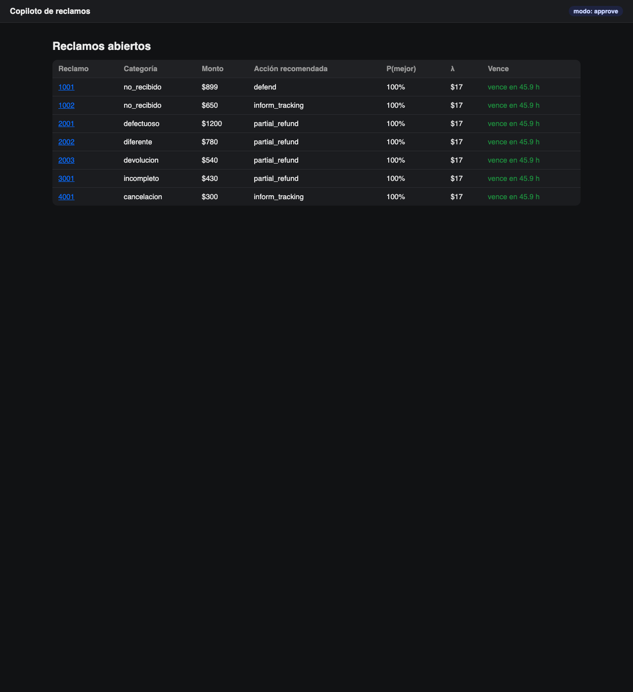
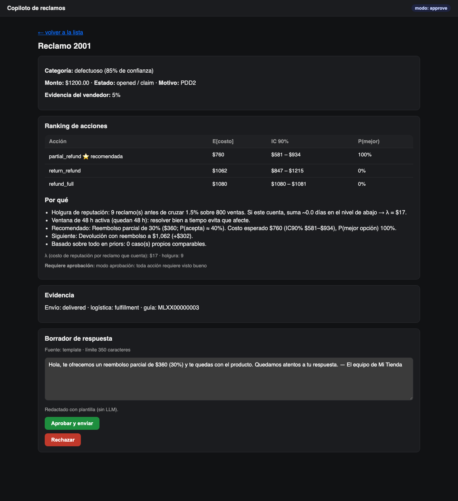
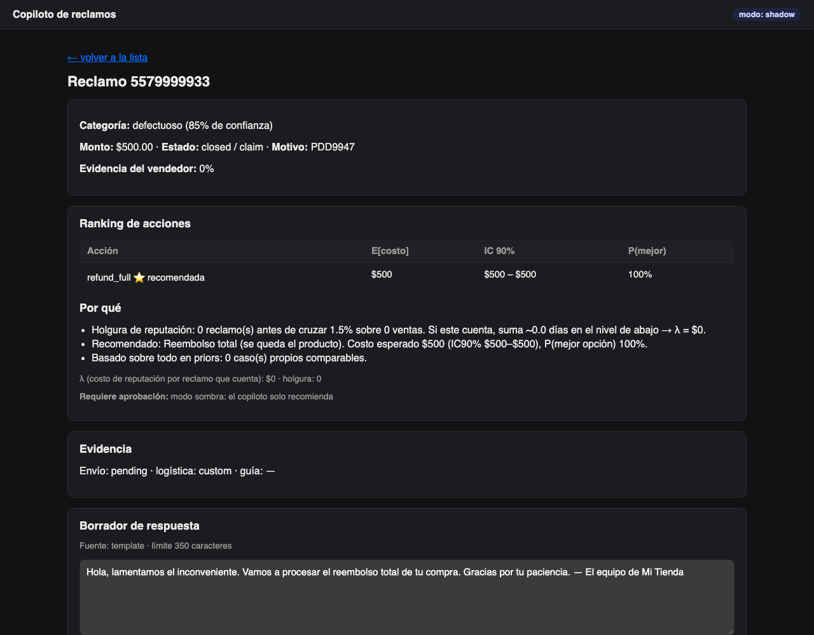
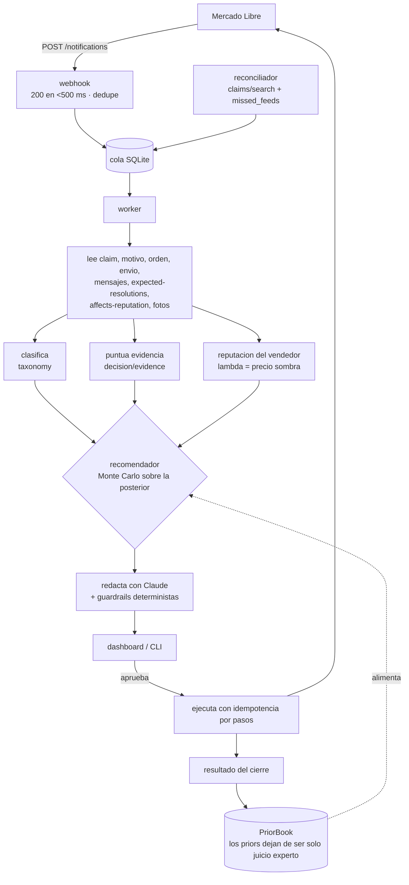

# Copiloto de reclamos — Mercado Libre México

Un copiloto para vendedores de Mercado Libre: recibe el webhook de un reclamo, lo clasifica,
junta evidencia, calcula la resolución de **menor costo esperado** y deja la respuesta
redactada — todo en minutos, con aprobación humana por defecto. Nunca ejecuta nada por sí solo
salvo que se lo pidas explícitamente (modo `auto`, y con topes).

**Estado: funciona de punta a punta contra la API real de Mercado Libre; en pausa comercial.**
El 19-sep-2026 procesó un reclamo real (`5579999933`) de principio a fin: webhook → clasificación
→ recomendación → borrador → ejecución (mensaje + reembolso) → Mercado Libre lo cerró como
`payment_refunded` → el resultado quedó registrado para actualizar los priors. El detalle, con el
contrato real de la API, está en [`docs/PRUEBA_REAL.md`](docs/PRUEBA_REAL.md). No se llevó a
producción con vendedores reales: es una decisión de asignación de tiempo, no una limitación
técnica.

## Qué demuestra este proyecto

| | |
|---|---|
| **Decisión bajo incertidumbre** | No es un clasificador que dice "reembolsa". Ordena las acciones por costo esperado con Monte Carlo sobre posteriores Beta, reporta intervalos de credibilidad y P(mejor opción), y manda a revisión humana cuando ninguna opción domina. |
| **Modelar lo que no es dinero** | La reputación no aparece en ningún endpoint como un costo. Se modela como precio sombra (λ): días extra en el nivel de abajo si este reclamo cuenta, integrando la probabilidad de cruzar el umbral con reclamos que entran (Gamma–Poisson) y salen (Binomial) de la ventana de 60 días. |
| **Integración real, no de juguete** | OAuth con PKCE y rotación de refresh tokens, webhook que responde en menos de 500 ms y encola, worker aparte, cola SQLite con reintentos, idempotencia por pasos para que nada que mueva dinero se repita, y reconciliación por si se pierde una notificación. |
| **Seguridad de un agente con LLM** | El borrador lo escribe Claude, pero los montos y porcentajes los fija el código y un guardrail determinista rechaza cualquier borrador que invente una cifra distinta. Los datos personales del comprador nunca llegan al modelo. Si el LLM falla, cae a plantillas. |
| **Honestidad sobre los supuestos** | Los priors son juicio experto y el README lo dice; se diluyen conforme entran casos reales. Cada supuesto no verificado contra la API está marcado `[supuesto]` en el código. |

### Capturas

Panel de reclamos abiertos, ordenados por urgencia (cada uno con su acción recomendada y λ):



Detalle de un reclamo: ranking de acciones con costo esperado e intervalo, las razones en
lenguaje llano, y el borrador editable antes de aprobar.



El reclamo real que se procesó en vivo (modo sombra, cuenta de prueba de Mercado Libre):



### La lección más cara

159 pruebas en verde no detectaron **seis** diferencias entre el simulador y la API real, porque
el simulador estaba escrito con los mismos supuestos que el código: validaba consistencia, no el
contrato. La peor de las seis: la orden llega en un campo distinto del que suponía, así que el
monto del reclamo salía en $0 — sin lanzar un error, sin romper ninguna prueba, y con una
recomendación que se veía perfectamente razonable. La tabla completa de diferencias está en
[`docs/PRUEBA_REAL.md`](docs/PRUEBA_REAL.md).

### Cómo contarlo

Guion de tres minutos, con las preguntas que suelen venir después y qué archivos enseñar:
[`docs/GUION_ENTREVISTA.md`](docs/GUION_ENTREVISTA.md).

## La tesis: el daño de un reclamo es de tiempo, no de razón

`GET /post-purchase/v1/claims/{id}/affects-reputation` devuelve `has_incentive`: si el
vendedor **resuelve satisfactoriamente dentro de las primeras 48 horas**, el reclamo no cuenta
contra su reputación. Fuera de esa ventana, sí — y la reputación de MLM se mide sobre 60 días
(365 si hubo pocas ventas) con umbrales duros por nivel (MercadoLíder 1 %, verde 1.5 %, amarillo
3 %, naranja 6 %).

El costo real de un reclamo casi nunca es el reembolso en sí: es lo que ese reclamo hace a tu
nivel de reputación si no lo resuelves a tiempo, y eso depende de qué tan cerca estás del
umbral (la **holgura**). El mismo reclamo defectuoso puede convenir **defenderlo** con holgura
de sobra o **concederlo de inmediato** pegado al umbral — no es la misma decisión, y una regla
fija ("siempre reembolsa" o "siempre defiende") pierde dinero en un lado o el otro. El copiloto
existe para que ninguna ventana de 48 horas se pierda por descuido, y para poner un precio real
(λ) a "qué tan caro es, hoy, que este reclamo cuente".

## Flujo



El detalle campo por campo de cada paso está en
[`docs/ARQUITECTURA.md`](docs/ARQUITECTURA.md).

## Quickstart

```bash
make install   # crea .venv e instala el paquete en modo editable con dependencias de dev
make test      # 165 tests, sin red, en ~4 s
make demo      # el flujo COMPLETO, offline, contra un simulador de Mercado Libre
.venv/bin/copiloto sandbox   # panel + worker vivos contra el simulador; tú haces de comprador
```

**Probarlo a mano: `copiloto sandbox`.** Levanta el dashboard real en `http://127.0.0.1:8000/`
con un worker en segundo plano y una consola en `/sandbox` donde tú haces de comprador y de
Mercado Libre: abrir reclamos nuevos desde 7 plantillas, aceptar o rechazar una oferta, pedir
mediación y que ML falle a favor de uno u otro. Apruebas o rechazas en el panel y ves cómo el
copiloto ejecuta contra la API simulada y registra el resultado del cierre (lo que alimenta el
aprendizaje de los priors). `--llm` hace que los borradores los escriba Claude con tu
`ANTHROPIC_API_KEY` (cuesta centavos por borrador); sin esa bandera se usan plantillas y nada
sale a la red.

`make demo` (o `.venv/bin/copiloto demo`) es la forma de validar de punta a punta **desde tu
computadora, sin credenciales ni red**: levanta un simulador de la API de Mercado Libre en el
mismo proceso, siembra 7 escenarios (uno por categoría), postea sus notificaciones al webhook,
drena la cola con el worker, imprime una tabla con la recomendación y el borrador de cada uno,
y por último aprueba y ejecuta uno de punta a punta para probar que la acción de verdad se
refleja en la API (simulada). Sin `ANTHROPIC_API_KEY` (o si lo corres con `make demo`, que la
ignora a propósito) todos los borradores salen de plantilla — ver más abajo.

Extracto de una corrida. Es determinista: el Monte Carlo se siembra por `claim_id` y consume
esa semilla en un orden fijo, así que cada corrida da la misma tabla aunque cambie el hash-seed
del proceso (lo cubre `tests/test_decision_determinism.py`):

```
Reclamo  Categoría    Acción           E[costo]  P(mejor)  λ    Borrador (inicio)                          
-------  -----------  ---------------  --------  --------  ---  -------------------------------------------
1001     no_recibido  defend           $70       100%      $17  Hola, el rastreo de Mercado Envíos muestra…
1002     no_recibido  inform_tracking  $196      100%      $17  Hola, tu paquete sigue en camino (guía MLX…
2001     defectuoso   partial_refund   $760      100%      $17  Hola, te ofrecemos un reembolso parcial de…
2002     diferente    partial_refund   $369      100%      $17  Hola, te ofrecemos un reembolso parcial de…
2003     devolucion   partial_refund   $301      100%      $17  Hola, te ofrecemos un reembolso parcial de…
3001     incompleto   partial_refund   $182      100%      $17  Hola, te ofrecemos un reembolso parcial de…
4001     cancelacion  inform_tracking  $152      100%      $17  Hola, tu pedido va en camino (guía MLXX000…

→ Aprobando y ejecutando el reclamo 2001 (acción: partial_refund)...
  mensajes al comprador en Mercado Libre (simulado): 1 → 2
  estado del reclamo: opened → opened
  oferta de reembolso parcial registrada en Mercado Libre (simulado): 30%
```

## Calculadora pública (`/calculadora`)

Página sin login que el servicio sirve en `/calculadora` y que también vive como Artifact
compartible. El vendedor escribe sus ventas de 60 días, los reclamos que ya cuentan, su nivel y
cuántos envíos gratis paga, y ve: cuántos reclamos le caben antes de bajar de color, cuánto le
costaría al mes bajar (diferencia de descuento en envíos + la pérdida de ventas que él estime) y
cuánto vale en pesos cada reclamo adicional que cuente, con la curva completa. Usa el mismo
modelo de `decision/reputation.py` portado a JavaScript (verificado: mismos números que Python).
Es el primer escalón del embudo: no pide acceso a la cuenta.

## Modos: shadow / approve / auto

| Modo | Qué hace |
|---|---|
| `shadow` (por defecto) | Solo recomienda y redacta. Nunca llama a un endpoint de escritura de Mercado Libre, ni con aprobación de por medio. Para arrancar y para el Plan B de `docs/PRUEBA_REAL.md`. |
| `approve` | Toda acción necesita que la apruebes (o edites y apruebes) en el dashboard antes de ejecutarse. |
| `auto` | Las acciones de `Policy.auto_actions` (por defecto `inform_tracking`, `return_refund`), por debajo de `auto_max_amount` y con `P(mejor) ≥ min_prob_best`, se auto-aprueban y ejecutan sin esperar a nadie. Todo lo demás sigue pidiendo aprobación. |

El cambio de modo es una variable de entorno (`COPILOTO_MODE`); no requiere redeploy de código.

## Variables de entorno

Ver `.env.example` para la lista completa y comentada (prefijo `COPILOTO_`, léelas con
`Settings.from_env()`). Las más importantes:

| Variable | Qué controla |
|---|---|
| `COPILOTO_APP_ID` / `COPILOTO_CLIENT_SECRET` / `COPILOTO_REDIRECT_URI` | credenciales OAuth de tu app en DevCenter |
| `COPILOTO_SECRET_KEY` | llave Fernet para cifrar tokens en reposo — **fíjala** en producción |
| `COPILOTO_DB_PATH` | dónde vive la base SQLite |
| `COPILOTO_MODE` | `shadow` \| `approve` \| `auto` |
| `COPILOTO_AUTO_MAX_AMOUNT` / `COPILOTO_MIN_PROB_BEST` | topes del modo `auto` |
| `COPILOTO_MESSAGE_MAX_CHARS` | límite del mensaje redactado |
| `COPILOTO_LLM_MODEL` / `COPILOTO_LLM_EFFORT` / `COPILOTO_LLM_ENABLED` | redacción con Claude; sin `ANTHROPIC_API_KEY` cae solo a plantillas |
| `COPILOTO_IP_ALLOWLIST_ENABLED` / `COPILOTO_TRUSTED_PROXY` | validación opcional de origen del webhook |
| `COPILOTO_EVIDENCE_PHOTOS_DIR` | fotos locales del vendedor (`<dir>/<order_id>/*.{jpg,png,pdf}`) |
| `COPILOTO_LEVEL_DROP_COST` / `COPILOTO_COGS_RATIO` / `COPILOTO_SKU_COSTS_PATH` / `COPILOTO_*_SHIPPING_COST` / `COPILOTO_HANDLING_COST` / `COPILOTO_MEDIATION_LABOR_COST` | la economía que alimenta `decision.domain.Economics` |
| `COPILOTO_STORE_NAME` / `COPILOTO_SIGNATURE` | identidad de la tienda en los mensajes |
| `COPILOTO_DASHBOARD_USER` / `COPILOTO_DASHBOARD_PASSWORD` | basic auth del dashboard (opcional) |

## Operar

```bash
copiloto init-db          # crea/migra la base
copiloto serve            # webhook + dashboard (uvicorn)
copiloto worker           # procesa la cola de jobs (proceso aparte)
copiloto reconcile-once   # una pasada de reconciliación y sale (para cron)
copiloto auth-url         # imprime la URL de autorización OAuth
copiloto stats            # conteos de jobs/eventos + latencia notificación→borrador (p50/p90)
copiloto demo             # el flujo completo, offline
```

`serve` y `worker` son procesos separados a propósito: el webhook nunca debe esperar a que un
reclamo se procese para responder, y un worker lento o caído no debe tumbar la recepción de
notificaciones. Coordinan solo a través de la misma base SQLite (WAL).

## Conectar a Mercado Libre real

Todo lo anterior corre offline contra `copiloto.meli.fake`. El runbook paso a paso para
conectarlo a la Mercado Libre real (app en DevCenter, túnel HTTPS, usuarios de prueba, comprar y
abrir un reclamo de verdad) está en **[`docs/PRUEBA_REAL.md`](docs/PRUEBA_REAL.md)**, junto con
el resultado de haberlo hecho: los reclamos **sí** funcionan con usuarios de prueba, y la tabla
de las seis diferencias entre la API real y lo que suponía el simulador.

## Supuestos y limitaciones

- **Priors de juicio experto**: las probabilidades de partida en `decision/priors.py`
  (P(mediación), P(ganar mediación), P(aceptar un % de parcial)...) son estimaciones razonadas,
  no datos — se diluyen a medida que el vendedor acumula `outcomes` propios (`PriorBook`
  reporta cuántos casos propios respaldan cada número en el `rationale` de cada recomendación).
  Con pocos reclamos cerrados, confía más en el criterio humano que en el número.
- **λ (precio sombra de reputación)** depende de `level_drop_cost`, un número que TÚ defines
  (cuánto vale para ti un nivel de reputación) — no es observable en la API. Si lo pones mal,
  el copiloto optimiza para el número equivocado.
- **Reglas de conteo**: qué cuenta o no contra la reputación en cada régimen (`won_mediation_
  counts`, `desist_counts_in_incentive` en `ReputationState`) son supuestos a calibrar con la
  respuesta real de `affects-reputation` al cerrar cada caso — por diseño, no con una tabla fija.
- Varias formas de payload de la API (`expected-resolutions`, `claims/reasons`, `returns` v2) no
  están fijadas en la documentación pública consultada; se implementaron con una forma razonable
  y están marcadas `[supuesto]` en el código (detalle en `docs/ARQUITECTURA.md`).
- El núcleo de decisión (`domain.py`, `taxonomy.py`, `decision/*`) es determinista dado un
  `ClaimContext`, pero el `ClaimContext` en sí depende de lecturas de una API externa que puede
  cambiar de forma sin avisar — de ahí el simulador y el runbook de validación real.

## Roadmap

- **Módulo 2 — auditoría de Full/paquetería**: hoy `fulfillment_by_ml` solo alimenta el prior de
  `coverage` (qué tan seguido ML absorbe la pérdida en una mediación cuando la logística es
  Full). Un módulo dedicado podría auditar sistemáticamente reclamos Full contra el inventario
  y las políticas de cobertura de Mercado Envíos, separando "perdió el vendedor" de "perdió
  Full" con más precisión que el prior actual.
- Aprendizaje activo del prior de `level_drop_cost` a partir de eventos reales de cambio de
  nivel, en vez de que lo fije el vendedor a mano.
- Multi-vendedor con aislamiento de datos si el copiloto pasa de una tienda a varias.

## Desarrollo

```bash
make lint   # ruff check src tests
make fmt    # ruff format src tests
make test   # pytest
```

`tests/` no hace ninguna llamada de red real (ni a Mercado Libre ni a Anthropic): usa
`copiloto.meli.fake` (FastAPI vía `TestClient`, en proceso) y dobles de prueba del cliente LLM.
